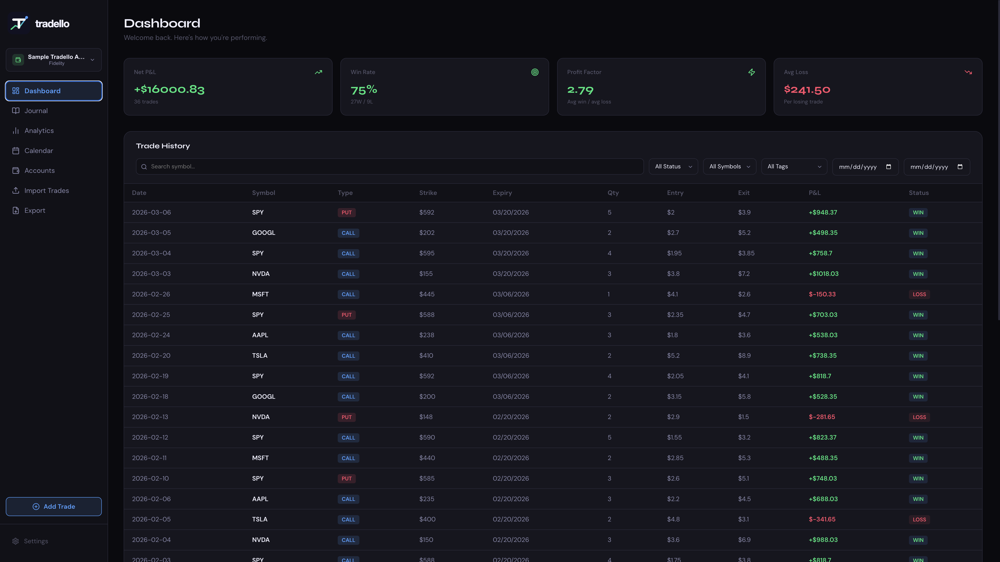
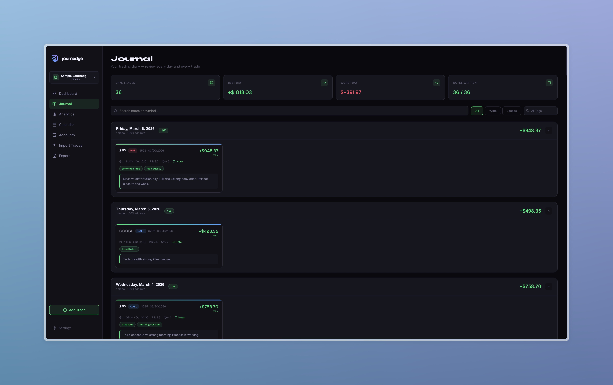
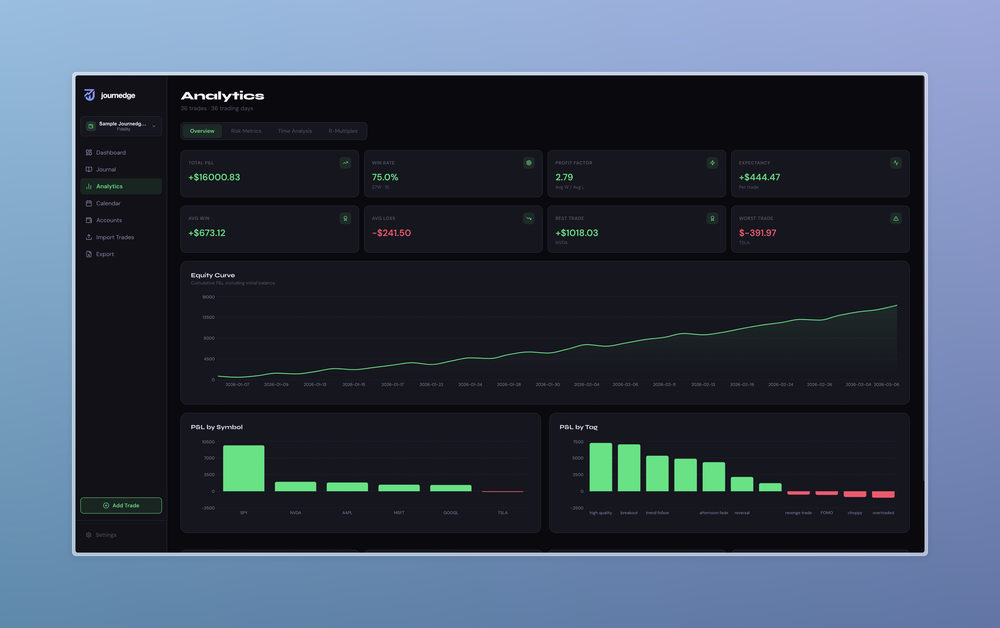
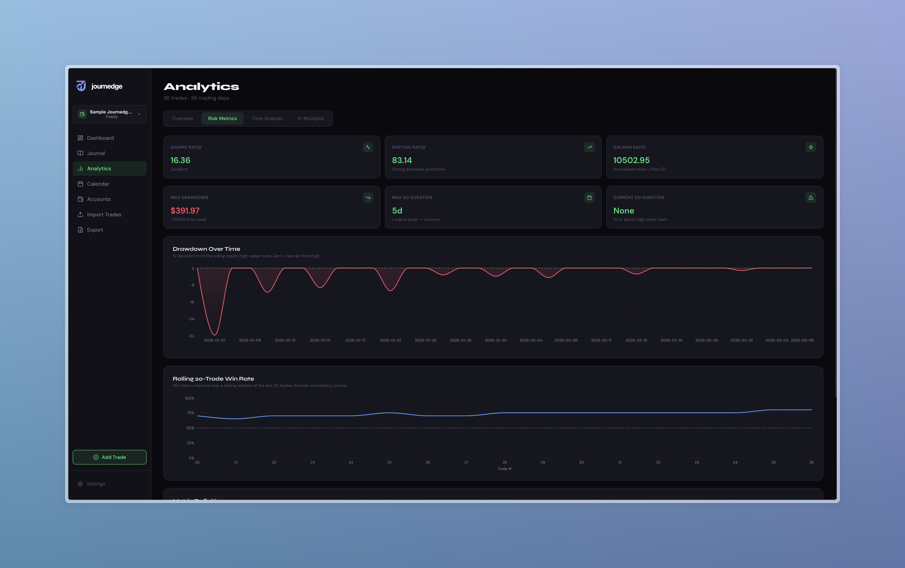
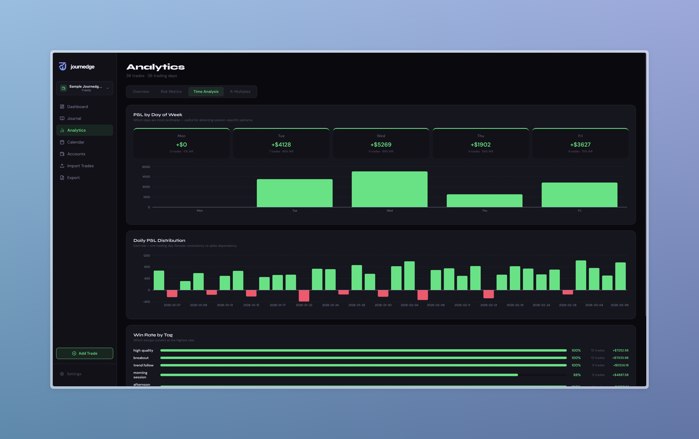
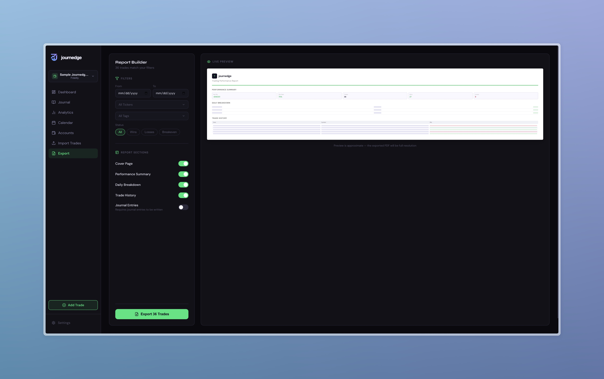

# Journedge

<div align="center">

<picture>
  <source media="(prefers-color-scheme: dark)" srcset="public/journedge-logo-dark.svg">
  <source media="(prefers-color-scheme: light)" srcset="public/journedge-logo-light.svg">
  
</picture>

<br /><br />


**An institutional-grade trading journal built for serious traders.**

[Features](#features) · [Screenshots](#screenshots) · [Getting Started](#getting-started) · [Importing Trades](#importing-trades) · [Analytics](#analytics-engine) · [Roadmap](#roadmap) · [Contributing](#contributing)

</div>

---

## Why Journedge

Most trading journals are either too simple to be useful or locked behind expensive subscriptions. Journedge is built differently.

**Your data stays yours.** Everything runs locally on your machine using SQLite. No cloud sync, no user accounts, no telemetry, no third-party data transfers. Your trade history, journal entries, and performance data never leave your machine.

**Built for serious traders.** Multi-account support, real equity curve tracking from actual starting balance, institutional-grade risk analytics, tag-based behavioural analysis, and a full rich text journal — not just a P&L spreadsheet.

**Open source and auditable.** The entire codebase is available, readable, and open to contribution. You can verify exactly what the application does with your data.

> Journedge was previously released as Tradello (v1.0.0 through v2.3.0). The project has been renamed to better reflect its core purpose — turning your journal into your edge. Full history is preserved in [CHANGELOG.md](./CHANGELOG.md).

---

## Screenshots

### Dashboard
Real-time stat cards, full trade history table with multi-filter support, and account-scoped P&L tracking.



### Journal Editor
Full-page rich text editor with formatting toolbar, trade stats header, tag management, and template support.



### Analytics — Overview
Equity curve from actual account balance, P&L by symbol, P&L by tag, win/loss breakdown, and streak analysis.



### Analytics — Risk Metrics
Sharpe, Sortino, and Calmar ratios. Drawdown curve over time. Rolling 20-trade win rate.



### Analytics — Time Analysis
P&L and win rate by day of week, daily distribution bars, and win rate by tag.



### Export
Report builder with date range, ticker, tag, and status filters. Live PDF preview.



---

## Features

### Trade Management

- Import trades from five brokers — format auto-detected on file drop, no configuration required
- Manual trade entry with live P&L preview, auto symbol detection, and OCC option symbol parsing
- Multi-account support — create separate accounts per broker, switch from the sidebar, all data is account-scoped
- Full trade journal with rich text, tags, screenshots, entry/exit times, R:R ratio, chart links
- Idempotent imports — re-importing the same file does not create duplicates

### Journal Editor

The journal editor is a full word processor built on TipTap and ProseMirror.

**Toolbar features:**
- Undo / Redo
- Font family — 15 fonts including DM Sans, Montserrat, Inter, Poppins, Playfair Display, Georgia, Times New Roman, and more. Google Fonts load dynamically on selection
- Font weight — Light through ExtraBold
- Headings H1, H2, H3
- Bold, italic, underline, strikethrough
- Text color — 40-swatch palette, pinnable colors, custom hex input
- Highlight — 20-swatch palette, pinnable colors, custom hex input
- Text alignment — left, center, right, justify
- Bullet and numbered lists
- Horizontal divider
- Link and image insertion

**Autosave** — content is saved 1.5 seconds after the last keystroke with a Saving / Saved indicator. No manual save required.

**Templates** — define a document structure once and save it as a template. Set it to auto-apply for specific trade types (options, stocks, futures, or all). When you open a new empty journal for a matching trade type, the template is applied automatically.

### Tag System

Tags are stored in a dedicated database table and shared globally across the app. Every entry point — the journal editor, the quick view panel, and the add trade modal — uses the same tag selector. Creating a new tag anywhere persists it immediately and makes it available everywhere. Existing tags from all your trades are seeded into the tag table on first load.

### Dashboard

- Stat cards for net P&L, win rate, profit factor, and average loss — reactive to active filters
- Filter by symbol, status, tag, date range, and free-text search simultaneously
- Full trade history table with click-to-open detail panel

### Analytics Engine

**Performance metrics**
- Net P&L and equity curve from initial account balance
- Win rate, profit factor, expectancy in dollars per trade
- Average win, average loss, best trade, worst trade
- Maximum win streak, maximum loss streak, current streak

**Risk metrics**
- Sharpe ratio — annualised to 252 trading days
- Sortino ratio — penalises downside deviation only
- Calmar ratio — annualised return divided by max drawdown
- Maximum drawdown in dollars and percentage from equity peak
- Longest and current drawdown duration

**Consistency analysis**
- Rolling 20-trade win rate
- Daily P&L distribution
- P&L by day of week with win rate per session

**R-Multiple analysis**
- R-multiple histogram using average loss as 1R proxy
- Average R per trade and expectancy in R units

**Breakdown analysis**
- P&L and win rate by underlying symbol
- P&L and win rate by tag

### Calendar

- Monthly calendar with per-day P&L colouring
- Click any day to open a detail panel — click any trade to open the full journal editor

### Export

- Report builder with date range, ticker, tag, and status filters
- Toggle individual sections — cover page, performance summary, daily breakdown, trade history, journal entries
- Live preview before generating
- PDF rendered entirely client-side — data never transmitted

### Settings

- Accent colour themes — green, blue, purple, orange, pink
- Trading preferences — default multiplier, commission, fees
- CSV export for backup or migration
- In-app auto-update — fetches latest release from GitHub, runs install and migration, prompts restart
- Automatic database backup before every update — last five retained

---

## Tech Stack

| Layer | Technology |
|-------|-----------|
| Framework | Next.js 16.1.6 (App Router, Turbopack) |
| Language | TypeScript 5 |
| Database | SQLite via Prisma 5 |
| Editor | TipTap 2 (ProseMirror) |
| Charts | Recharts 3 |
| PDF | @react-pdf/renderer 4 |
| Icons | Lucide React |
| Styling | Inline styles with CSS custom properties |

---

## Getting Started

### Prerequisites

- Node.js 20 or higher
- npm or yarn

### Installation

```bash
git clone https://github.com/TheQuantum-Dev/journedge.git
cd journedge
npm install
cp .env.example .env
npx prisma migrate dev
npm run dev
```

Open [http://localhost:3000](http://localhost:3000) in your browser.

### First Steps

1. Go to **Accounts** and create your first account — name it, select your broker, and enter your starting balance.
2. Go to **Import Trades** and drop your broker CSV. Format is detected automatically.
3. Your trades populate immediately across Dashboard, Journal, Analytics, Calendar, and Export.
4. Open the Journal, click **Open Journal** on any trade, and start writing.

---

## Importing Trades

| Broker | Status | Notes |
|--------|--------|-------|
| Fidelity | ✅ Supported | Export from Activity and Orders |
| TD Ameritrade | ✅ Supported | Works with post-Schwab merger exports |
| Tastytrade | ✅ Supported | Options, stocks, and futures supported |
| Interactive Brokers | ✅ Supported | Export from Flex Query or Activity Statement |
| Journedge Export | ✅ Supported | Re-import your own exports — all journal data preserved |

### How to export from Fidelity
1. Go to **Accounts and Trade → Activity and Orders**
2. Select your date range
3. Click **Download** and choose CSV

### How to export from Tastytrade
1. Go to **History**
2. Set your date range
3. Click **Export** in the top right

### How to export from TD Ameritrade
1. Go to **My Account → History and Statements**
2. Select **Transactions** and your date range
3. Export as CSV

### How to export from Interactive Brokers
1. Go to **Reports → Flex Queries** or open an **Activity Statement**
2. Set format to CSV
3. Ensure the **Trades** section is included

---

## Architecture Notes

**Database.** SQLite via Prisma. All data is local. The database file lives at `prisma/journedge.db` and is gitignored.

**CSV parsers.** Each broker has an isolated parser in `app/lib/`. The import page runs format detection in priority order — Journedge export first, then Tastytrade, TD Ameritrade, IBKR, with Fidelity as the fallback.

**Journal editor.** Built on TipTap with ProseMirror as the underlying engine. Documents are stored as TipTap JSON in the existing `journalEntry` TEXT column. Legacy plain-text entries render as plain paragraphs. Autosave debounces 1.5 seconds and patches the in-memory trade immediately so navigation never shows stale content.

**Tag system.** Tags are stored in a dedicated `Tag` table. On first load, `AppContext` seeds the table from all existing trade tag arrays. Every subsequent tag creation writes to the database and updates global state in memory — no full reload required.

**Template system.** Templates are stored in a `JournalTemplate` table as TipTap JSON with a scope string (`all`, `option`, `stock`, `future`, or comma-separated combinations). Auto-apply runs when the editor opens an empty journal — it queries matching templates and applies silently if exactly one matches.

**PDF generation.** `@react-pdf/renderer` runs entirely in the browser via a dynamic import with `ssr: false`.

**Auto-update.** The update endpoint streams progress via Server-Sent Events through six steps — git preflight, database backup, stash, tag checkout, npm install, prisma migrate. The database backup retains the five most recent copies and is non-fatal on failure.

**State management.** A single React Context holds all trades, accounts, tags, and navigation state. `updateTradeInMemory` patches a single trade in the array without a full API reload — used by autosave and tag saves in the editor.

---

## Project Structure

```
journedge/
├── app/
│   ├── api/
│   │   ├── accounts/            # Account CRUD
│   │   ├── trades/              # Trade read, write, patch, clear
│   │   ├── tags/
│   │   ├── templates/
│   │   ├── upload/              # Screenshot file uploads
│   │   └── update/              # Auto-update SSE stream + restart endpoint
│   ├── components/
│   │   ├── Sidebar.tsx          # Navigation and account switcher
│   │   ├── TradePanel.tsx       # Slide-out journal and edit panel
│   │   ├── AddTradeModal.tsx    # Manual trade entry
│   │   ├── TagSelector.tsx
│   │   ├── JournalToolbar.tsx
│   │   ├── TradingReportPDF.tsx # PDF document definition
│   │   └── ExportPDFInner.tsx   # Client-only PDF download wrapper
│   ├── context/
│   │   └── AppContext.tsx       # Global state — trades, accounts, navigation
│   ├── hooks/
│   │   └── useSettings.ts       # Settings persistence via localStorage
│   ├── lib/
│   │   ├── types.ts             # Shared Trade and Account interfaces
│   │   ├── db.ts                # Prisma client singleton
│   │   ├── svgToPng.ts          # SVG rasteriser for PDF logo
│   │   ├── parseFidelityCSV.ts
│   │   ├── parseTDAmeritradeCSV.ts
│   │   ├── parseTastytradeCSV.ts
│   │   ├── parseIBKRCSV.ts
│   │   └── parseJournedgeCSV.ts  # Journedge export format parser
│   └── pages/
│       ├── Dashboard.tsx
│       ├── JournalPage.tsx
│       └── JournalEditorPage.tsx  # Journal Editor Page
│       ├── AnalyticsPage.tsx
│       ├── CalendarPage.tsx
│       ├── ImportPage.tsx
│       ├── AccountsPage.tsx
│       ├── ExportPage.tsx
│       └── SettingsPage.tsx
├── prisma/
│   ├── schema.prisma            # Database schema
│   └── migrations/              # Full migration history
├── public/
│   ├── journedge-logo-dark.svg
│   ├── journedge-logo-light.svg
│   └── journedge-icon.svg
├── scripts/
│   └── changelog.js             # Automated changelog entry generator
└── backups/                     # Auto-update database backups (gitignored)
```

---

## Roadmap

**v3.1.0 — Current**
- Full-page rich text journal editor
- Tag system rebuilt at the database level
- Template system with instrument-type scoping
- Font family and weight picker
- Advanced color picker with pinning and hex input
- Text alignment

**v3.2.0 — Planned**
- MAE/MFE tracking per trade
- Overtrading detection
- Risk of ruin calculator
- GitHub Wiki

---

## Contributing

Contributions are welcome. Please read [CONTRIBUTING.md](./CONTRIBUTING.md) before opening a pull request.

---

## Changelog

See [CHANGELOG.md](./CHANGELOG.md) for full release history back to v1.0.0.

---

## Security

See [SECURITY.md](./SECURITY.md) for the vulnerability disclosure policy.

---

## License

Journedge is open source under the [MIT License](./LICENSE).

---

<div align="center">

Built by [TheQuantum-Dev](https://github.com/TheQuantum-Dev)

*Built for traders who take their craft seriously.*

</div>
